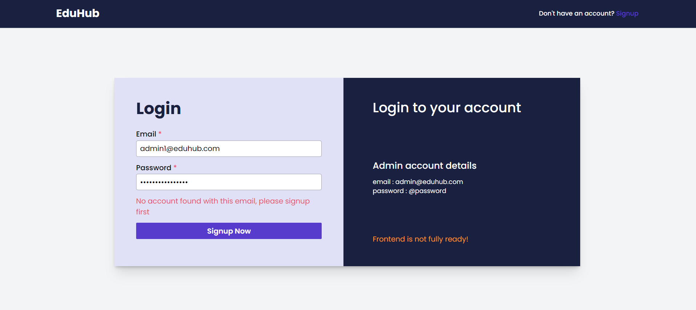
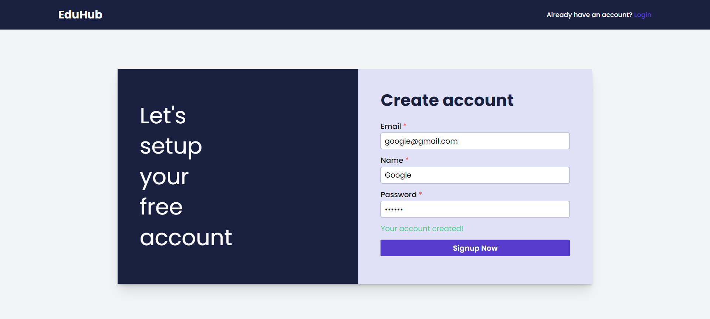
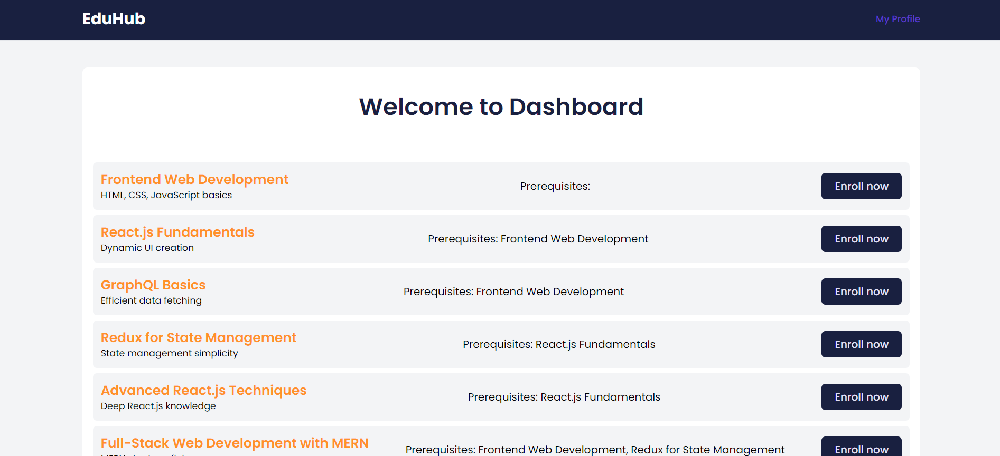

# EduHub (LMS)

## Introduction
EduHub is a comprehensive LMS designed to facilitate interactive online learning by connecting instructors (admins) and students through courses and live lectures. allowing students to select courses that match their interests and engage deeply with the course content and fellow learners. It features secure user registration and login processes for students and admins. Upon registration, students select their courses of interest. Authentication mechanisms verify user credentials before granting access.

## Live Links
**Frontend:** https://eduhub.raghavbhatirv.in/login
<br>
**Backend:** https://fantastic-apron-bat.cyclic.app/
<br>


## Tech Stack
Our LMS is built with a robust tech stack to ensure performance, scalability, and ease of use.

### Backend
- Node.js
- Express.js
- MongoDB
- Mongoose
- GraphQL
- Apollo Server

### Frontend
- React.js
- Context API
- Apollo Client
- Tailwind CSS

## Installation
To get started with the project, follow these steps:

1. Clone the repository.

```bash
https://github.com/Raghavbhati/EduHub-IdeaClan.git
```

2. cd folder.

```bash
cd backend/frontend
```

3. Install the dependencies using.

```bash
npm install
```

3. Start the application by running.

```bash
npm run dev
```

The backend application will start running on port 8888.
<br>
The frontend application will start running on port localhost.

## API Endpoints
Our API is built with GraphQL. Here are some of the main queries and mutations:

### Queries
- `users`: Get all users
- `user`: Get a single user profile
- `courses`: Get all courses
- `course`: Get a single course
- `lectures`: Get all lectures
- `lecture`: Get a single lecture

### Mutations
- `createUser`: Register a new user
- `loginUser`: Login a user
- `passwordChange`: Change a user's password
- `deleteUser`: Delete a user
- `enrollCourse`: Enroll a user in a course
- `createCourse`: Create a new course
- `updateCourse`: Update a course
- `deleteCourse`: Delete a course
- `createLecture`: Create a new lecture
- `updateLecture`: Update a lecture
- `deleteLecture`: Delete a lecture

Note: Only admins can perform certain actions such as creating, updating, and deleting courses and lectures.

## Frontend
Our frontend is designed to be intuitive and user-friendly. Here are some screenshots of our main pages:

- Login Page:
  
- Signup Page:
  
- Dashboard:
  
- Profile:
  


## Important links:

**Portfolio:** https://www.raghavbhatirv.in/
<br>
**Github:** https://github.com/Raghavbhati
<br>
**Linkdin:** https://www.linkedin.com/in/raghavbhatirv/
<br>
**Twitter:** https://twitter.com/raghavbhatirv/
